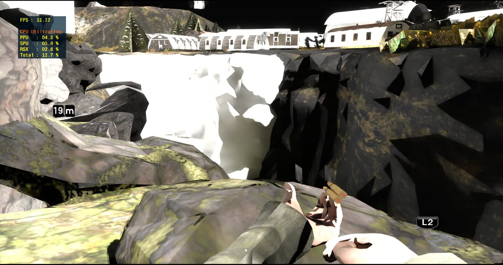
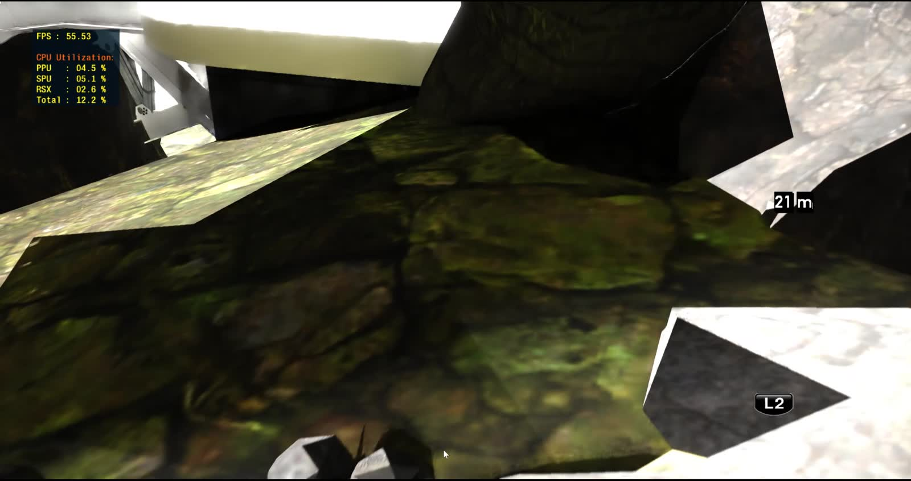
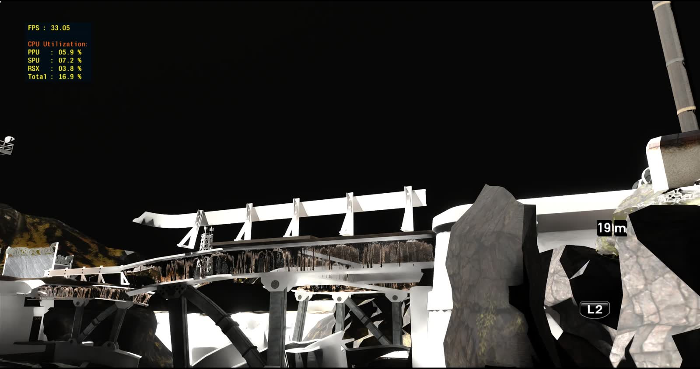

# RPCS3 with a native RTX Remix render backend

This is a fork of [RPCS3](https://github.com/RPCS3/rpcs3) that adds a **render backend which
submits PlayStation 3 geometry to the RTX Remix runtime through the Remix API**, so a PS3 title is
path traced rather than rasterised.

There is no d3d9 wrapper and no proxy DLL. The backend calls `remixapi_*` directly -- meshes,
materials, instances, skinning, lights and a camera, submitted every frame. That matters because
the normal route into Remix is intercepting a game's fixed-function D3D9 calls, and **RSX has no
fixed-function transform unit**. There is no `SetTransform` to read a view matrix out of; the
view-projection is folded into whatever constant slots the game's own vertex program happens to
use. Recovering it is the central problem this fork solves -- see
[How the camera is recovered](#how-the-camera-is-recovered).

The sibling project is [pcsx2-rtx-remix](https://github.com/BRAGme/pcsx2-rtx-remix), the same idea
for PlayStation 2. The consoles need genuinely different techniques (VU1 microcode back-slicing
there, vertex-program fingerprinting here), so the two READMEs are worth reading together if you
are attempting this for a third machine.

Everything about the base emulator is unchanged and documented in
[upstream's README](https://github.com/RPCS3/rpcs3/blob/master/README.md).

---

## Requirements

**This fork does not work with the stock NVIDIA RTX Remix runtime.** It requires the
**Remix Plus** fork of dxvk-remix:

| | |
|---|---|
| Runtime | [`RemixProjGroup/dxvk-remix`](https://github.com/RemixProjGroup/dxvk-remix), maintainer Kim2091 |
| Release tag | `remix-plus-1.5.1` (tag object `f4173a9c8b94736363cb27c3bd228059780acbcf`) |
| Asset | `Remix_Plus_v1.5.1_x64_games_release.zip` |
| API version | `0.1000.1` -- the vendored `remix_c.h`, additive over `0.1000.0` (`2f10eb5`) |

Remix Plus reserves `REMIXAPI_VERSION_MINOR = 1000`
(`rpcs3/Emu/RSX/Remix/remix_c.h:58-67`), and the runtime's compatibility check treats every minor
as breaking while `MAJOR == 0`. Stock dxvk-remix is on the `0.6.x` line, so the handshake rejects
it outright rather than running on with mismatched struct layouts and category bits. `PATCH` is
ignored by that check, which is why `0.1000.1` still matches a `remix-plus-1.5.1` runtime.

The vendored `rpcs3/Emu/RSX/Remix/remix_c.h` is never hand-edited. It is copied wholesale from the
fork's `public/include/remix/remix_c.h`; a single missed struct member silently misroutes every
interface slot after the divergence, and that fails at run time, not at build time.

### Installing the runtime

The backend resolves the runtime DLL as (`rpcs3/Emu/RSX/Remix/RemixRuntime.cpp:67-77`):

1. `RPCS3_REMIX_DLL`, if set, used verbatim;
2. otherwise `<exe dir>/remix/d3d9.dll`.

Unzip the Remix Plus release into a `remix\` **subfolder** next to `rpcs3.exe`. **Do not drop
`d3d9.dll` directly beside the executable** -- a file by that name there would be picked up by
anything else in the process that resolves it, which is exactly why the subdirectory is mandatory
rather than a convention.

---

## What it looks like

All three stills are frames lifted from a screen capture on this branch. Captures date fast and
this branch moves several times a day, so each is labelled with **when it was captured and what the
branch tip was at that moment**.



*Resistance 2 (NPEA00431). Captured 2026-08-08 06:38; branch tip `148b467`. Everything in this
frame comes through the Remix API: world geometry placed by matrices recovered from the title's own
vertex programs, albedo and lichen detail from texcoords decoded out of the same ucode, the
first-person arms and shotgun shells skinned through `remixapi_MeshInfoSkinning`, and the distance
marker composited by the 2D path. The white shards mid-frame are real -- a subset of draws still
lands at runaway positions. 12.7 fps here; see the next frame for what a bounded view costs.*



*Same capture, 55.5 fps. Texcoords resolved out of the vertex program, so tiling surfaces carry
their detail. The gap between this and the frame above is view complexity, not a fixed cost --
skipping the title's lighting passes took the frame from 45.8 ms to 17.5 ms, but a wide outdoor
draw list still dominates.*



*Same capture. Structural geometry with per-draw blend state and path-traced shadowing. The sky
reads black because sky classification anchors to the camera and does not fire on every frame --
a known gap, not an art choice.*

<!-- video link: source clips are not committed -- a git repo is a poor video host. Upload
     rpcs3__2026-08-08__06-36-55.mp4 and drop the URL here. -->

---

## Current status

This is the further-along of the two backends: camera, textures, skinned characters, per-draw blend
state, sky classification and UI compositing all work on at least one title. It is still a research
backend, not a product.

### What has been measured

| Area | State | Evidence |
|---|---|---|
| Camera / world transforms | Working | `world_applied` went 34.1% -> **100% of submitted draws** on Resistance 2 once the HPOS chain could be recovered through a register (`ae94587`). On Haze, matching `ADD`'s src2 constant recovered **71% of world transforms** that had been submitting identity (`41d9adc`). |
| Textures | Working | Texcoords and the position decode are read out of the vertex program (`9c73eb0e`, `188b242`); alpha test honoured. |
| Skinned characters | Working | Both of Resistance 2's rigs -- 16 programs binding one indexed matrix per vertex, 16 more blending four from a palette -- are submitted natively through `remixapi_MeshInfoSkinning`, so Remix does the blend and the mesh content stays static rigging (`81af315`). |
| Vertex colours, sky, cull state | Working | `8931f16`, `81af315`. Sky is anchored by camera rather than by geometry. |
| Game UI compositing | Working | `19d54522`, `2414498`. |
| First-person viewmodels | Landed, not runtime-verified | Detected by viewport depth range and tagged `VIEW_MODEL` (`148b467`); given their own camera reference rather than the world one (`4945c7eb`). |
| Texture cache | Working | 2,905,684 cache hits against 41 texture creations, 19 live, no unbounded growth -- measured on Minecraft: PlayStation 3 Edition (NPUB31419). |

### Titles

Only three titles appear anywhere in the branch log or the dump comments, and they are the only
ones any claim above rests on:

- **Resistance 2** (`NPEA00431`) -- the primary development title; nearly every measurement above
  is from it.
- **Haze** -- vertex quantisation scale and the `ADD` src2 transform fix (`e9a7956`, `41d9adc`).
- **Minecraft: PlayStation 3 Edition** (`NPUB31419`) -- camera parity and texture-cache
  measurements.

There is no compatibility table and this README will not invent one. Any other title is untested.

### What is not done

- **The viewmodel camera divide is new.** `4945c7eb` compiles and links (`msbuild rpcs3.sln
  /t:rpcs3 /p:Configuration=Release /p:Platform=x64` exits 0) but has not been runtime-verified.
  `RPCS3_REMIX_VIEWMODELCAM=0` restores the previous behaviour exactly if it misbehaves.
- **Two skinning-recovery mechanisms ship defaulted off.** `RPCS3_REMIX_INDEXEDUNIFORM` and
  `RPCS3_REMIX_INDEXEDBIASREG` each address part of the 119,357 draws Resistance 2 loses to the
  indexed-const gate over a 2m41s capture, and each is off until a run says what it recovers.
- **`match_basis_affine` is recognised but not applied.** The object placement it finds is composed
  and logged, deliberately not used, because wiring it in moves 82,190 draws at once and that wants
  checking against a drawn frame first.
- **Lighting is largely the path tracer's, not the game's.** Reconstructing PS3 light sources is
  not attempted.
- **No binary release yet.** Build from source; see below. A release is planned.

---

## How the camera is recovered

This is the transferable part.

Remix needs a per-frame view-projection. A fixed-function D3D9 game hands its view and projection
matrices to the driver and an interposer simply reads them. **RSX offers nothing equivalent.** By
the time geometry exists it has been through a vertex program the game wrote, and the
view-projection has been folded into that program's constant slots -- at whatever indices that
particular program happens to use, composed with whatever else the author decided to fold in.
Nothing labels it.

So the backend **fingerprints the vertex program**. For each distinct ucode it disassembles the
program and walks backwards from `HPOS`, the clip-space output, looking for the chain that produced
it. The canonical shape is four `DP4`s, one per component, over one common source -- that is a 4x4
matrix multiply, and the constant slot the `DP4`s read is where the matrix lives. Recover that slot
and you have a matrix that is *derived from the program that uses it*, not scored as plausible.

The interesting work is all in the ways real programs deviate from the canonical shape while still
being ordinary transforms. Three examples, each of which was a class of broken frames:

- **The chain terminates in an `ADD` with the constant in `src2`.** `ADD` on RSX consumes `src0`
  and `src2` -- `vec_source_mask(ADD)` is `0b101`, there is no `src1` -- and Haze writes
  `ADD o0.xyzw, r2, c[3]`, accumulator first. A matcher that only scanned slots 0 and 1 rejected
  the whole 4x4, submitted identity, and piled raw model-space vertices at the world origin: vertex
  explosions and characters standing in the wrong place, both from the same cause. Fixing the
  operand indices recovered **71% of that title's world draws** (`41d9adc`).
- **One of the four writers is a `MOV`.** Resistance 2 computes its `w` row into a temp and moves
  it out afterwards, so a strict four-`DP4` matcher discarded the matrix. Of R2's 129 programs, 46
  came back "no matrix chain into HPOS" and 29 were exactly this shape. Following a `MOV` back to
  the instruction that defined the component it forwards, then re-running the existing matchers,
  resolved 33 of the 46 and took `world_applied` from 34.1% to **100% of submitted draws**
  (`ae94587`).
- **The address register applies abs-then-negate before truncation.** Reading the signed value gave
  `31 + (-1) = c30`, a rank-1 matrix with two zero columns, and every skinned character drew as a
  long thin diagonal box. The magnitudes across all 16 programs are 1, 4, 10, 19 -- every one
  congruent to 1 mod 3, which with three rows per bone puts bones at c32, c35, c41, c50, exactly
  three apart. The signed values are not congruent. The congruence is the proof (`81af315`).

The method that found all three is the same and it is the recommendation: **replay real ucode from
dumps rather than reason about symptoms.** `RPCS3_REMIX_DUMP` writes the disassembled programs and
the matrices each draw resolved; the matchers can then be re-run offline over a whole capture and
the answer counted rather than argued. In `ae94587`, six hypotheses died on counters before the
surviving one was found. Every percentage in this README came out of that loop.

The backend also learns which archetype each program belongs to -- world transform, skinned rig
with an indexed palette, skinned rig blending four weighted bones, post-process blit, sky, 2D
overlay -- and routes the draw accordingly, because a post-process blit submitted as world geometry
is a full-screen quad sitting in the middle of the scene. The classification and every knob that
bisects it are documented in
[`rpcs3/Emu/RSX/Remix/RemixTransforms.h`](rpcs3/Emu/RSX/Remix/RemixTransforms.h).

---

## Building (Windows)

Follow upstream [`BUILDING.md`](BUILDING.md). It is correct and this fork changes none of it: VS2022
x64, Python 3.6+, the Vulkan SDK, Qt with `QTDIR` set, then `rpcs3.sln`. The Remix runtime is loaded
at run time and is **not** a build dependency.

```bat
call "...\VC\Auxiliary\Build\vcvars64.bat"
set QTDIR=C:\Qt\6.10.3\msvc2022_64
msbuild rpcs3.sln /m:6 /nodeReuse:false /p:Configuration=Release /p:Platform=x64
```

### Known traps on Windows

These are notes from building *this* fork on one Windows machine, not corrections to upstream. Each
is a symptom that cost real time.

| Symptom | Cause and fix |
|---|---|
| Qt codegen fails with `'"\bin\moc.exe"' is not recognized`, MSB8066, exit code 9009 | `QTDIR` is unset in the shell you invoked msbuild from. Upstream documents `QTDIR` at [`BUILDING.md:29`](BUILDING.md), but a clean non-VS shell still hits this every time. Set `$env:QTDIR = "<Qt>\6.x\msvc2022_64"` before msbuild -- the trailing `msvc2022_64` matters. |
| `aqtinstall` cannot fetch the Qt version upstream asks for | Upstream lists Qt 6.11.1; aqtinstall 3.3.0 cannot fetch 6.11+. **Qt 6.10.3 via aqt builds this fork fine** and is what the numbers above were built with. |
| Build dies with MSB4166, "child node exited prematurely" | Unbounded `/m` spawns more msbuild nodes than the machine survives. Use `/m:6 /nodeReuse:false`. Node reuse in particular leaves stale nodes holding file handles between builds. |
| Link errors against the precompiled `llvmlibs_mt.7z` | It does not link under MSVC 14.44. Build LLVM from source instead -- `3rdparty\llvm\llvm_build.vcxproj`. This is long and one-time; after that incremental builds are normal speed. |
| `rpcs3_test` fails with `Cannot open include file: 'gtest/gtest.h'` | The googletest NuGet package is not restored. This is the unit-test project only and does not affect `rpcs3.exe`; build the `rpcs3` target (`/t:rpcs3`) to skip it. |

Select the backend under *Configuration -> GPU -> Renderer*, and the RTX Remix page is the last
entry in the *Configuration* menu.

---

## Knobs

The backend reads **79** `RPCS3_REMIX_*` environment variables. They are a bisect surface as much
as a tuning surface: most exist so a single run can attribute a visual change to one specific
decision rather than to a whole milestone.

**[`docs/remix/KNOBS.md`](docs/remix/KNOBS.md)** is the reference -- name, default, effect, and
whether the knob is also on the GUI page (31 of the 79 are). Where both exist the environment
variable wins when set, so measurement scripts stay authoritative over whatever the GUI last wrote.

---

## License and credits

GPL-2.0, unchanged from upstream. This fork adds `rpcs3/Emu/RSX/Remix/` and `docs/remix/`, plus the
RTX Remix settings page; everything else is RPCS3's.

- **[RPCS3](https://github.com/RPCS3/rpcs3)** and its contributors -- the emulator this forks.
- **[NVIDIA RTX Remix](https://github.com/NVIDIAGameWorks/rtx-remix)** -- the runtime and the API.
- **[Remix Plus](https://github.com/RemixProjGroup/dxvk-remix)** (maintainer Kim2091) -- the
  dxvk-remix fork this pins, and the source of the API surface this backend depends on.

Bugs here belong to this fork. Please do not take RPCS3 issues about the Remix renderer to the
RPCS3 project.

### Provenance, and upstream's AI policy

Upstream RPCS3 has an explicit [AI Use](https://github.com/RPCS3/rpcs3#ai-use) policy, and it is a
fair one: AI tooling is permitted for research and reverse engineering, but a contributor is
expected to fully own and understand what they submit, and untested AI-generated output wastes
maintainer time.

So, plainly: **development on this branch is AI-assisted.** The work is done with Claude and most
commits carry a `Co-Authored-By` trailer. The decisions, the code and the measurements are owned by
a human. The practices that make that claim checkable are the ones upstream is asking for anyway --
every behavioural claim in the commit log is a counter or a percentage that was measured on a real
capture, a commit that was not build-tested is tagged `(UNVERIFIED)` in its subject line (`8931f16`,
`19d54522`), and hypotheses that were *refuted* are committed and named rather than quietly
dropped.

**No pull request has been opened against upstream RPCS3 and none is planned from this branch.**
This is a research fork; it is not upstream-ready and does not pretend to be.
